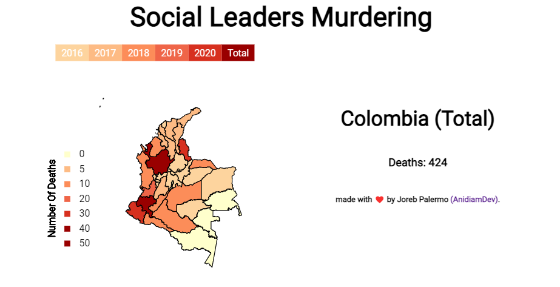
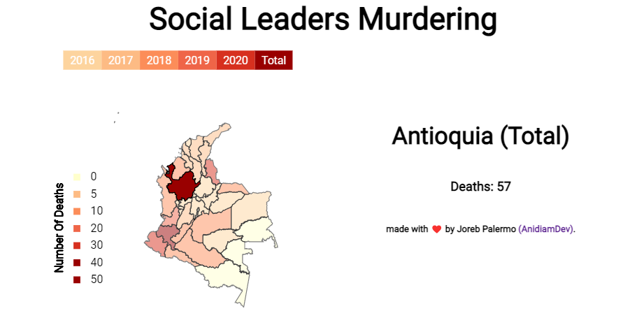
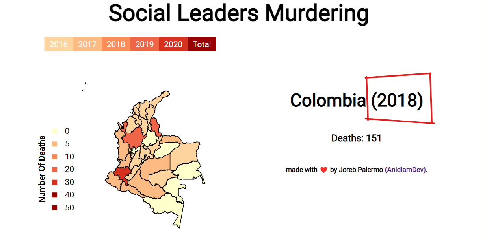

# The Colombian Violence Problem => What Got Me Into Making This.

So, as a colombian, during my life i've seen a lot of incredible news about the way the country was already in a continuous state of violence, beeing everyday worst than the last, until the peace process came in, and left some of those problems behind, but already, brought some new.

And one of the problems that has been on the table since the peace process was made, is our topic for today:

## The Colombian Social Leaders Beeing Murdered.

Out of political opinions about the way the things are beeing made by the goverment, and stuff, this is a topic that goes further, because Social Leaders are usually normal people who is just trying to contribute to their community.

And that's why im here, trying to make their Deaths be visible from the tecnologies that i know.

## The Project Itself, Out Of The Motivation For It.

This project is something i've been working on since a little while, and basicly, i was trying to get confortable with ES6, and thought the best way of doing that would be by learning some new technologie, and thats were D3js came in.

Basicly made it because i thought it would be very cool doing a serious JS project for once, and this was so.

You can Visit it now [here](https://anidiamdev.github.io/lideres-sociales-colombia/).

Also, the place where i worked with the data and well, the api, is hosted [here](https://lideressocialesrest.anidiamdev.repl.co).

## A Simple Look At How The Project Looks Like Now (07/04/22)(DD/MM/YY)

The project looks like this:

The visualiztion does have two main functionalities that you can use, and those are:

Selecting a department: Show the total amount for the department during the time you select.

Selecting a year: displays how would the map look like for that specific year, you can also select a department once you have selected a year, and it will display how that department did during that year.

